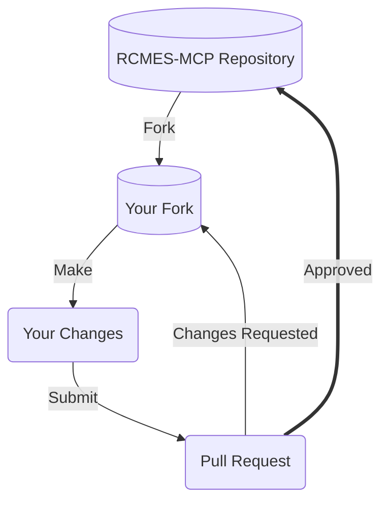

# Contributing to RCMES-MCP

Thanks for taking the time to consider contributing! We appreciate your time and effort. This document outlines the many ways you can contribute to our project, and provides detailed guidance on best practices.

## Prerequisites

### License

Our project is licensed under the [Apache License 2.0](LICENSE). Please review the license terms before contributing.

### Code of Conduct

Please read our [Code of Conduct](CODE_OF_CONDUCT.md) and ensure you agree to its terms.

### Developer Environment

To contribute code, you'll need:

1. Python 3.10+
2. Git
3. A GitHub account

Set up your local environment:

```bash
git clone https://github.com/NASA-JPL/rcmes-mcp.git
cd rcmes-mcp
pip install -e ".[dev]"
```

### Communication Channels

- [GitHub Issues](https://github.com/NASA-JPL/rcmes-mcp/issues) — report bugs or propose changes
- [GitHub Discussions](https://github.com/NASA-JPL/rcmes-mcp/discussions) — questions and general conversation
- Email: kyongsik.yun@jpl.nasa.gov

## Our Development Process



### Fork our Repository

Forking is the preferred way to propose changes. See [GitHub's forking guide](https://docs.github.com/en/get-started/quickstart/fork-a-repo).

#### Find or File an Issue

Check our [issue tracker](https://github.com/NASA-JPL/rcmes-mcp/issues) for existing issues, or file a new one before starting work.

### Make your Modifications

1. Create a feature branch from `main`
2. Make your changes
3. Write or update tests as needed
4. Ensure all tests pass:

```bash
pytest
ruff check src/
mypy src/
```

#### Commit Messages

Reference issue tickets in commit messages:

```
Issue #42 - Add support for new climate variable
```

Keep commits atomic and meaningful. Squash "fix typo" or "cleanup" commits before submitting a PR.

### Submit a Pull Request

Navigate to your fork and submit a pull request. Our [PR template](.github/PULL_REQUEST_TEMPLATE.md) will guide you through the required information.

**Working on your first Pull Request?** See [How to Contribute to an Open Source Project on GitHub](https://kcd.im/pull-request).

### Pull Request Review Criteria

- **Intent** — is the purpose clearly stated?
- **Solution** — does the PR achieve its goal?
- **Correctness** — does it work correctly?
- **Small Patches** — is the scope manageable for review?
- **Tests** — are there meaningful tests?
- **Readability** — is the code maintainable?

## Ways to Contribute

### Issue Tickets

Filing and triaging issues is a great way to contribute. See our [issues](https://github.com/NASA-JPL/rcmes-mcp/issues).

- Look for issues labeled `good first issue` to get started
- Help identify and close duplicate issues
- Suggest new labels for better issue organization

#### Submitting Bug Reports

Before filing, check for existing duplicates. Include:
- Code snippet reproducing the bug
- Reproducible steps
- Full error message or stacktrace
- OS and Python version

#### Submitting Feature Requests

Before filing, check for duplicates and consider if existing features or third-party tools address your need.

#### Security Vulnerabilities

**Do not** file security issues publicly. See [SECURITY.md](SECURITY.md) for reporting instructions.

### Code

1. Find or create an issue for your contribution
2. Set up your [developer environment](#developer-environment)
3. Follow our [development process](#our-development-process)

Guidelines:
- Read existing code and documentation to understand context
- Communicate your plans through issues before starting large changes
- Follow the existing code style (enforced by `ruff`)

### Documentation

We value quality documentation. Contributions to README, docstrings, and guides are welcome.

- **Minimum viable docs** — write what's needed, no more
- **Changed code = changed docs** — update docs when code changes
- **Delete old docs** — remove outdated documentation
